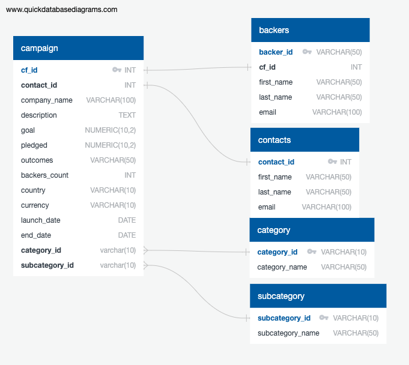

# Crowdfunding-ETL

# **Purpose**
Independent Funding is a company that provides a crowdfunding platform to people looking to raise money for projects or business ventures. The goal of this challenge was to help them perform an ETL process on a new dataset and analyze this data using SQL queries.

## **Goal**
- Extract Data
- Transform and Clean Data
- Create an ERD and Table Schema, and Load Data
- Perform SQL Analysis

## **Resources**
- Resources: backer_info.csv, crowdfunding_db
- Software: PGAdmin/ SQL, Excel, Visual Studio Code, Python, Pandas

## **Results**
To extract the data in the first step of this project, I did the following: 
- loaded the csv file and converted each row to a dictionary 
- Iterated through each dictionary to retrieve their values and saved the values 
- created the backers_df using the list of values retrieved

To transform the data in the second step, I completed the following:
- Checked the data types of the columns to make sure the "cf_id" column was an integer
- Split the "name" column into first and last names, and saved those values into new columns
- Dropped unneeded “name” column
- Reordered the columns

In the third step, I created a backers table in the Crowdfunding Database (crowdfunding_db) and added relationships between the existing table to the new “backers” table. I also used pgAdmin to upload the backers.csv file into the backers table. See the file called crowdfunding_db_schema.sql for table schema and the below image for table relationships:

In the last step, I analyzed the crowdfunding database with the newly added backers information.
- I wrote a query that retrieved the number of backer counts in descending order for each cf_id and for all the live campaigns. This showed that there were 14 different live crowdfunding campaigns with the cf_id of 65 having the most backer counts at 3,640.

- I confirmed this count by writing a query that retrieved the same information from the backers table.
- I wrote a query that created the email_contacts_remaining_goal_amount table, and exported it as email_contacts_remaining_goal_amount.csv. This table contains the contact information for all live campaigns and how much more money was needed to reach the goal. This way Independent funding could contact these individuals for updates on their campaigns. There were 14 contacts matching the amount of current campaigns.

- I wrote a query that created the email_backers_remaining_goal_amount table, and exported it as email_contacts_remaining_goal_amount.csv. This table contains the contact information to the backers of the live campaigns and tells them how much more money is needed to reach the goal. This way Independent Funding could contact the backers and give them updates on the campaigns. There were 8,175 backers they could contact.
